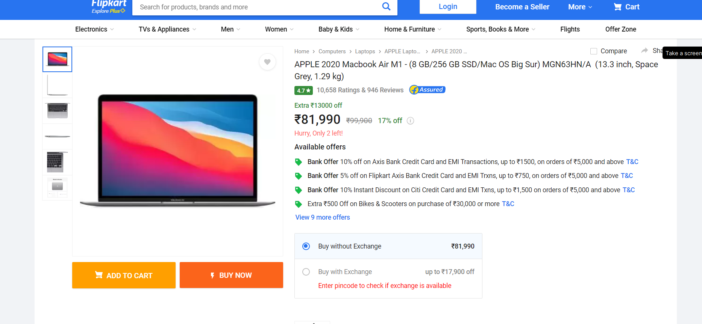

# Today-s-price 

Step 1: Basic requirements
Install Node.js in your system
https://nodejs.org/en/download/
(optional) a good text/code editor we prefer VS code
https://code.visualstudio.com/

step 2: Installing the required packages.
Run this command to Install node-fetch (a library to make HTTP requests)

    npm install node-fetch

Run this command to Install Cheerio (a library to scrape information from web pages)

    npm install cheerio

3: basic information

Before we create a function to scrap details from the page let us visit a Flipkart product page like this one (https://www.flipkart.com/apple-2020-macbook-air-m1-8-gb-256-gb-ssd-mac-os-big-sur-mgn63hn-a/p/itmde54f026889ce) and find the elements that have the name and the price of the product. We will need the element’s class name to be able to find the elements when we extract the data.

